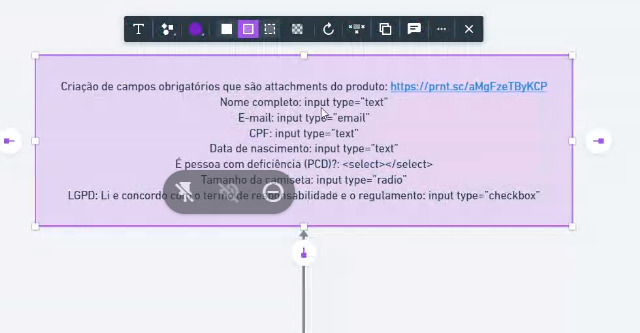
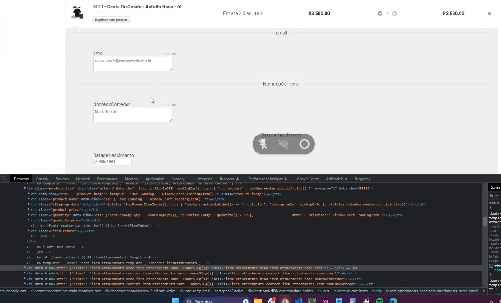

bp hoje ele esta divido em 3 situações

uma é uma landing page e outra pdp

lp: https://www.figma.com/file/CkcII72EKYSUyzxcExeSOA/LP-BPC-2023?node-id=0-1&t=35XoUijJDawFsuo5-0
fluxo: https://www.figma.com/file/CkcII72EKYSUyzxcExeSOA/LP-BPC-2023?node-id=0-1&t=35XoUijJDawFsuo5-0

A landing page vai sempre abrir o modal, em todos os CTAS. O modal são produtos. 
landing page e modal é tudo via site editor.

o modal são produtos do bota pra correr. Cada um vai para uma determinada PDP

O fluxo mencionado tem a ver tudo com a pdp..

elemntos para corrida:
percurso, escolha cor do tenis. proxima etapa esta travada.

ao ir para a proxima etapa, cria um modal

todas informações são via attatchment:

no checkout vai ter todos os attatchments preenchidos:

limitar quantidade no carrinho do mesmo sku no carrinho/checkout
