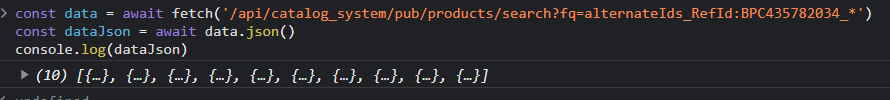
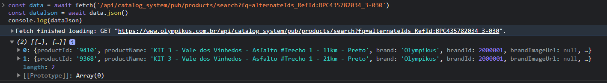
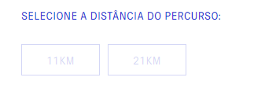
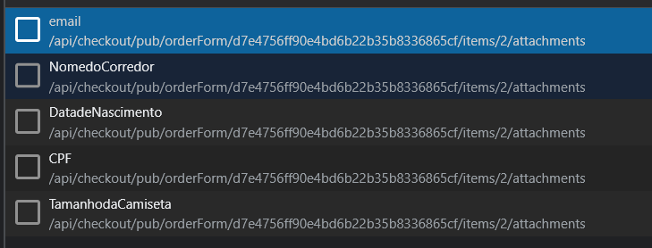
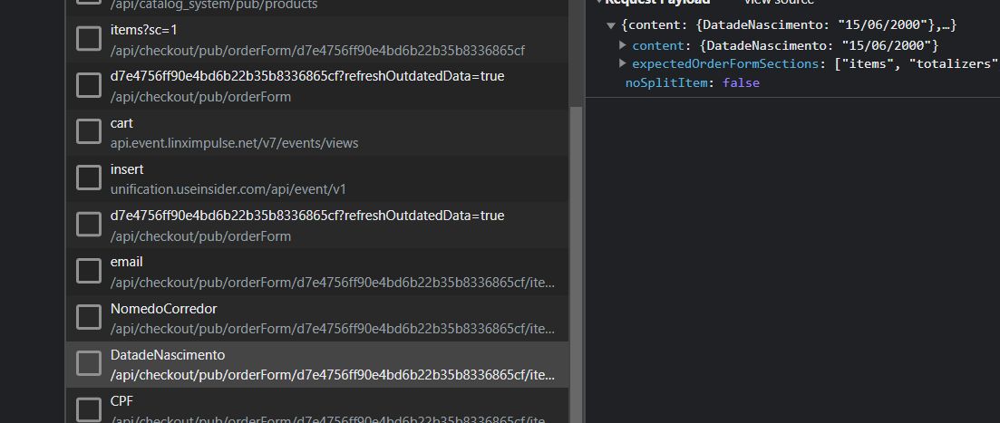

# Master data

tabela BP

estrutura de dados:
https://olympikus.ds.vtexcrm.com.br/#RGF0YUVudGl0eSNGb3JtRGF0YSNyb3dJZD1CUCMjI0Zvcm1EYXRhX1N1Y2VzcyNBamF4UmVxdWVz%0adEVycm9yI2NvbnRlbnQ%3d

lista:
https://olympikus.vtexcrm.com.br/#RHluYW1pY0Zvcm0jSW5kZXgjZm9ybUlkPTg3YTk1MmZhLTk1OTktNGYzMy05Y2JiLWYwY2ZkMDk0MGFmYiZjdXN0b21TZWFyY2hJZD1udWxsJmN1cnI9MjM0OTQwIyMjRHluYW1pY0Zvcm1fSW5kZXhfTG9hZF9TdWNlc3MjQWpheFJlcXVlc3RFcnJvciNjb250ZW50

# Apis

### enviar dados para a tabela BP

fetch("https://www.olympikus.com.br/api/dataentities/BP/documents")
{
"headers": {
"content-type": "application/json",
},
"body": "{\"shirts\":\"M\",\"name\":\"arthur teste\",\"email\":\"arthur.lins@penseavanti.com.br\",\"cpf\":
\"509.886.018-00\",\"birthday\":\"15/06/2000\",\"acceptTerms\":true,\"pcd\":true,\"skuId\":\"53894\",\"productId\":
\"9368\",\"age60\":false}",
"method": "PUT",
"mode": "cors",
"credentials": "include"
}
**payload**

```JSON
{
  "shirts": "P",
  "name": "arthur teste",
  "email": "arthur.lins@penseavanti.com.br",
  "cpf": "509.886.018-00",
  "birthday": "20/20/1920",
  "acceptTerms": true,
  "pcd": true,
  "skuId": "54403",
  "productId": "9409",
  "age60": false
}
```

### puxar lista de tamanho camisetas

Não é necessário. São attatchments

### puxar lista de cores tenis

produtos com ref do inicio iguais


```javascript
const data = await fetch('/api/catalog_system/pub/products/search?fq=alternateIds_RefId:BPC435782034_*')
const dataJson = await data.json()
```

### puxar lista de 'selecione a distancia do percurso'

variação especificação



```javascript
const data = await fetch('/api/catalog_system/pub/products/search?fq=alternateIds_RefId:BPC435782034_3-030')
const dataJson = await data.json()
```

### enviar attatchments ao orderform


campos para mandar: [DatadeNascimento,email,NomedoCorredor,DatadeNascimento,CPF,TamnhodaCamiseta]

```javascript
fetch(
  `/api/checkout/pub/orderForm/${ID DO ORDERFORM}/items/${POSICAO DO SKU NO CARRINHO}/attachments/${NOME DO ANEXO CADASTRADO NO ADMIN}`,
  {
    method: 'POST',
    mode: 'cors',
    credentials: 'include',
    headers: {},
    body: JSON.stringify({
      content: {
        'NOME DO ITEM DO ANEXO': 'VALOR DO ANEXO',
      },
      expectedOrderFormSections: [
        'items',
        'totalizers',
        'clientProfileData',
        'shippingData',
        'paymentData',
        'sellers',
        'messages',
        'marketingData',
        'clientPreferencesData',
        'storePreferencesData',
        'giftRegistryData',
        'ratesAndBenefitsData',
        'openTextField',
        'commercialConditionData',
        'customData',
      ],
      noSplitItem: true,
    }),
  }
);
```

