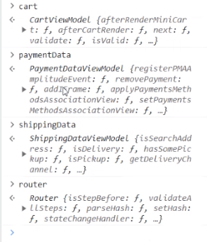

## como carreagfr todos os filtros no search
## filtros search

caso o truncate esteja ativo, e mesmo assim tenha um lazy load, vai ser necessario tornar "__RUNTIME__.settings["vtex.store"].enableSearchRenderingOptimization" false.

para isso, desative essa opção em https://ws.myvtex.com/admin/cms/store:

