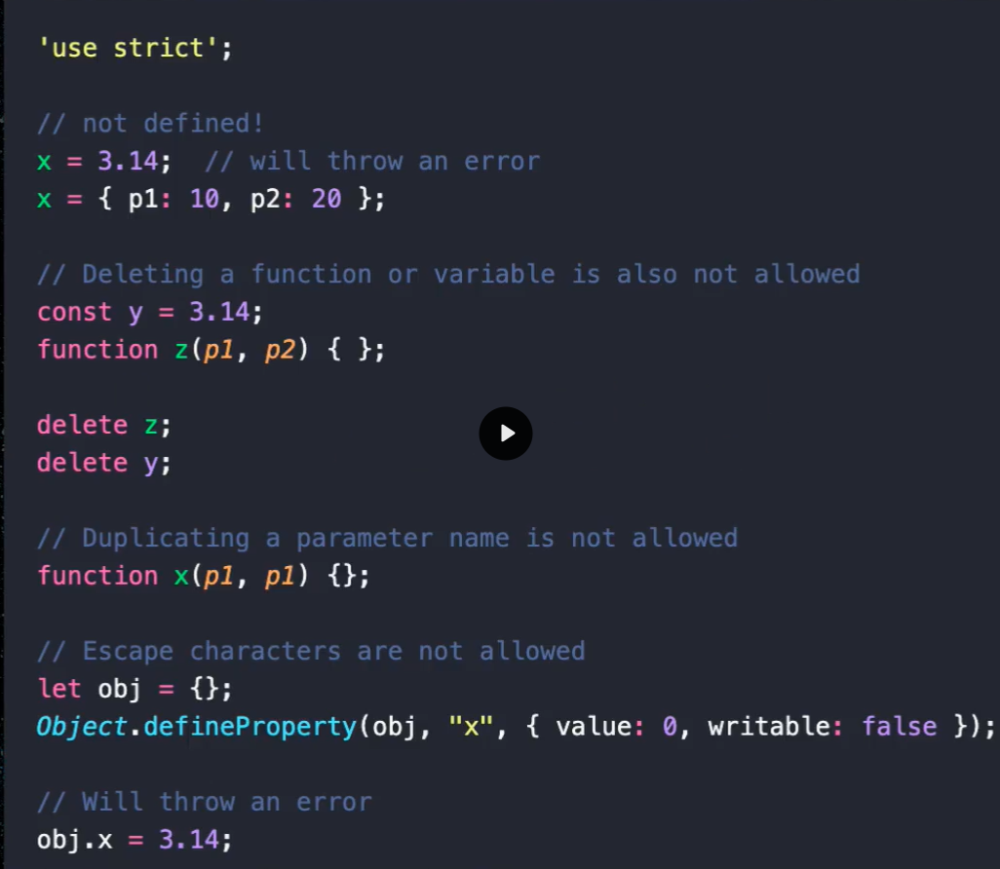

em 2015 uma nova diretiva foi adicionada ao javascript que tem uma serie de regras que tem o objetivo de evitar erros semanaticas silenciosos no javascript. O use-strict é usado por padrão em transpiradores como typescript,babel e é algo precioso para evitar erro de forma inesperada.

Para utilizar basta adicionar 'use-strict' no inicio de cada arquivo que o compilador vai validar essas regras

Javascript é uma linguagem que é convertida para binario no motor NodeJs e existe um processo de otimização que verifica o seu codigo a todo momento. Ele analisa se é possivel gerar uma nova classe otimizada, se é possivel encurtar caminhos e etc.

Quanto mais otimizado for, mais rapido será a compilação para a linguagem intermediaria