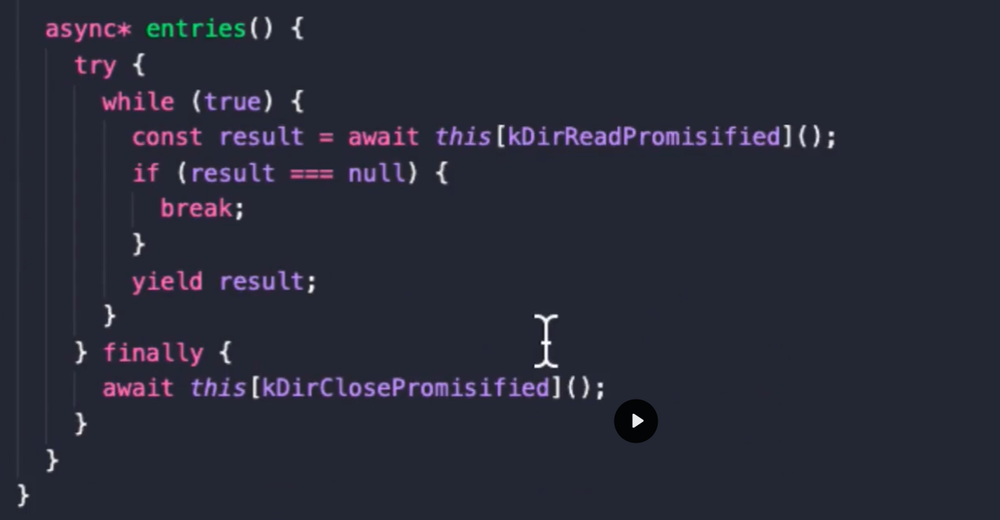

<!-- TOC -->

* [generators](#generators)
    * [Definição](#definição)
        * [Generators por padrão possuem as funções next, return.](####generators-por-padrão-possuem-as-funções-next-return)
        * [se o done estiver true, significa que a lista foi finalizada](####se-o-done-estiver-true-significa-que-a-lista-foi-finalizada)
        * [Se a gente passar uma função como asteristico, ele não vai entender que a gente quer que ele execute, ele vai retornar a função apenas para ser executada posteriormente](####se-a-gente-passar-uma-função-como-asteristico-ele-não-vai-entender-que-a-gente-quer-que-ele-execute-ele-vai-retornar-a-função-apenas-para-ser-executada-posteriormente)
    * [consumindo dados retornados pelo generator](#consumindo-dados-retornados-pelo-generator)
        * [É possivel consumir o generator através de funções retornadas por ele mesmo, como next()](####é-possivel-consumir-o-generator-através-de-funções-retornadas-por-ele-mesmo-como-next)
        * [Consumindo os valores através de iteradores](####consumindo-os-valores-através-de-iteradores)
            * [É possivel consumir o generator através do operator rest spread](#é-possivel-consumir-o-generator-através-do-operator-rest-spread)
            * [É possivel consumir o generator através da função Array.from](#é-possivel-consumir-o-generator-através-da-função-arrayfrom)
            * [É possivel consumir o generator através do iterador for of](#é-possivel-consumir-o-generator-através-do-iterador-for-of)
* [Async iterators](#async-iterators)
    * [Definição](#definição-1)
        * [Entendedo o codigo presente no NodeJs em relação ao readDir](#entendedo-o-codigo-presente-no-nodejs-em-relação-ao-readdir)
    * [Resolvendo promises](#resolvendo-promises)
        * [Como nenhuma promisse foi resolvida, vai trazer a promise pendente](#como-nenhuma-promisse-foi-resolvida-vai-trazer-a-promise-pendente)
        * [Eu posso utilizar o promise.all para resolver todas as promisses](#eu-posso-utilizar-o-promiseall-para-resolver-todas-as-promisses)
        * [Eu posso utilizar o for await para resolver todas as promisses](#eu-posso-utilizar-o-for-await-para-resolver-todas-as-promisses)

<!-- TOC -->

# generators

## Definição

Generators tem a função de fazer com que funções virem listas, e entreguem os dados sob demanda.

Tudo no NodeJs usa isso.

Quando um gerador é chamado, ele retorna um objeto iterador que segue o protocolo de iteração. Esse objeto possui um
método next(), que quando invocado, executa o corpo do gerador até encontrar uma declaração yield. A execução do gerador
é pausada nesse ponto, e o valor após o yield é retornado como a propriedade value do objeto de retorno. Além disso, o
objeto de retorno possui uma propriedade booleana done que indica se o gerador já foi concluído (true) ou não (false).

```javascript
class Fibonacci {
  * execute(input, current = 0, next = 1) {


    if (input === 0) {
      return
    }

    // retorna o valor
    yield current

    // delega a função, mas nao retorna valor
    yield* this.execute(input - 1, next, current + next)
  }
}


module.exports = Fibonacci
```

#### Generators por padrão possuem as funções next, return.

```javascript
function* main() {
  yield 'Hello'
}
```

```bash
{value: 'Hello', done: false}
```

#### se o done estiver true, significa que a lista foi finalizada

```javascript
function* main() {
  yield 'Hello'
}


const generator = main()

console.log(generator.next())
console.log(generator.next())
```

```bash
{ value: 'Hello', done: false }
{ value: undefined, done: true }
```

---

#### Se a gente passar uma função sem o asteristico, ele não vai entender que a gente quer que ele execute, ele vai retornar a função apenas para ser executada posteriormente

```javascript
function* main() {
  yield 'Hello'
  yield '-'
  yield 'World'
}


const generator = main()
console.log(generator.next())
```

```bash
{ value: undefined, done: true }
```

## consumindo dados retornados pelo generator

* É possivel consumir o generator através de funções retornadas por ele mesmo, como next()
* É possivel consumir o generator através do operator rest spread
* É possivel consumir o generator através da função Array.from
* É possivel consumir o generator através do iterador for of

### É possivel consumir o generator através de funções retornadas por ele mesmo, como next()

```javascript
function* main() {
  yield 'Hello'
  yield '-'
  yield 'World'
}


const generator = main()
console.log(generator.next())
console.log(generator.next())
console.log(generator.next())
console.log(generator.next())
```

```bash
{ value: 'Hello', done: false }
{ value: '-', done: false }
{ value: 'World', done: false }
{ value: undefined, done: true }
```

### Consumindo os valores através de iteradores

#### É possivel consumir o generator através do operator rest spread

```javascript
function* main() {
  yield 'um'
  yield 'dois'
  yield 'tres'
}


console.log([ ...main() ])
```

```bash
[ 'um', 'dois', 'tres' ]
```

#### É possivel consumir o generator através da função Array.from

```javascript
function* main() {
  yield 'um'
  yield 'dois'
  yield 'tres'
}


console.log(Array.from(main()))
```

```bash
[ 'um', 'dois', 'tres' ]
```

#### É possivel consumir o generator através do iterador for of

```javascript
const { readFile, stat, readdir } = require('fs/promises')


async function* systemInfo() {
  const file = await readFile(__filename)
  yield { file: file.toString() }

  const { size } = await stat(__filename)
  yield { size }

  const dir = await readdir(__dirname)
  yield { dir }
}

;(async () => {
  for await( const item of systemInfo() ) {
    console.log('systemInfo', item)
  }
})()
```

```bash

systemInfo {
  file: "const {readFile,stat,readdir } =  require('fs/promises')\r\n" +
    '\r\n' +
    'async function* systemInfo() {\r\n' +
    '  const file = await readFile(__filename)\r\n' +
    '  yield {file: file.toString()}\r\n' +
    '\r\n' +
    '  const { size } = await stat(__filename)\r\n' +
    '  yield {size}\r\n' +
    '\r\n' +
    '  const dir = await readdir(__dirname)\r\n' +
    '  yield { dir}\r\n' +
    '}\r\n' +
    '\r\n' +
    ';(async () => {\r\n' +
    '  for await(const item of systemInfo() ) {\r\n' +
    "    console.log('systemInfo', item)\r\n" +
    '  }\r\n' +
    '})()'
}
systemInfo { size: 399 }
systemInfo { dir: [ 'async-iterator.js', 'generators.js' ] }
```

# Async iterators

## Definição

#### Entendedo o codigo presente no NodeJs em relação ao readDir

Para trazer o entries de dentro do Dir, ele faz um while, e qnaunto o resultado estiver chegando diferente de null, ele
continua fazendo. E quando for igual a null, ele para o nosso resultado


## Resolvendo promises

#### Como nenhuma promisse foi resolvida, vai trazer a promise pendente

```javascript
function* promisified() {
  yield readFile(__filename)
  yield Promise.resolve('Um')
}


console.log(...promisified())
```

```bash
Promise { <pending> } Promise { 'Um' }
```

#### Eu posso utilizar o promise.all para resolver todas as promisses

```javascript
function* promisified() {
  yield readFile(__filename)
  yield Promise.resolve('Um')
  yield Promise.resolve('Dois')
}


Promise.all([ ...promisified() ]).then(r => console.log('promisified', r))
```

```bash
promisified [
  <Buffer 63 6f 6e 73 74 20 7b 72 65 61 64 46 69 6c 65 2c 73 74 61 74 2c 72 65 61 64 64 69 72 20 7d 20 3d 20 20 72 65 71 75 69 72 65 28 27 66 73 2f 70 72 6f 6d ... 373 more bytes>,
  'Um'
]
```

#### Eu posso utilizar o for await para resolver todas as promisses

```javascript
function* promisified() {
  yield readFile(__filename)
  yield Promise.resolve('Um')
  yield Promise.resolve('Dois')
}


// basicamente ele esta recebendo uma lista de tarefas:
// primeiro leia o arquivo
// depois resolva as promisses 'um'
// depois retoresolva as promisses 'dois'
;(async () => {
  for await( const item of promisified() ) {
    console.log('for await', item.toString())
  }
})()
```

```bash
for await const {readFile,stat,readdir } =  require('fs/promises')

function* promisified() {
  yield readFile(__filename)
  yield Promise.resolve('Um')
  yield Promise.resolve('Dois')
}


// IFE, uma função que se auto executa

// basicamente ele esta recebendo uma lista de tarefas:
// primeiro leia o arquivo
// depois resolva as promisses 'um'
// depois retoresolva as promisses 'dois'
;(async () => {
  for await(const item of promisified() ) {
    console.log('for await', item.toString())
  }
})()
for await Um
for await Dois
```