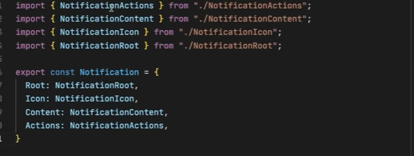

# ou

```tsx
import { PropsWithChildren } from "react"

export type BodyProps = {
  className?: string
} & React.HTMLAttributes<HTMLDivElement>

export const Body = ({ children }: BodyProps) => {
  return (
    <div className={"container-body"}>
      {children}
    </div>
  )
}
const LeftBottomSide = ({ children }: PropsWithChildren) => {
  return (
    <div className='testes'>
      {children}
    </div>
  )
}

Body.LeftBottomSide = LeftBottomSide
```
