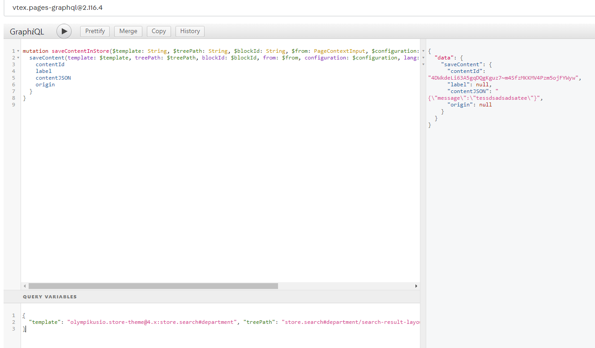

# Mutation
```graphql
mutation saveContentInStore($template: String, $treePath: String, $blockId: String, $from: PageContextInput, $configuration: ContentConfigurationInput, $lang: String, $bindingId: String) {
  saveContent(template: $template, treePath: $treePath, blockId: $blockId, from: $from, configuration: $configuration, lang: $lang, bindingId: $bindingId) {
    contentId
    label
    contentJSON
    origin
  }
}
```

# Parametros IDE-graphql
```json
{
  "template": "olympikusio.store-theme@4.x:store.search#department", "treePath": "store.search#department/search-result-layout#departamento/search-result-layout.desktop/flex-layout.row#search-breadcrumb/flex-layout.col#orderby/flex-layout.row#orderByAndSwitcher/order-by.v2", "blockId": "vtex.search-result@3.x:order-by.v2", "lang": "pt-BR", "bindingId": "43ff0222-dce4-4a83-9f6f-a0f123ab38e7", "configuration": {"status": "ACTIVE", "condition": {"allMatches": true, "id": "be4fa4c4ff2661651aa33e656d1aa9d61e096392", "pageContext": {"id": "3", "type": "department"}, "statements": []}, "contentId": "4DWkdeLi63A5gqDQgKguz7~m4SfzMKKMV4Pzm5ojFYWyw", "contentJSON": "{\"message\":\"tessdsadsadsatee\"}", "label": null, "origin": null}
}
```

# Parametros identados
```json
{
    "template": "olympikusio.store-theme@4.x:store.search#department",
    "treePath": "store.search#department/search-result-layout#departamento/search-result-layout.desktop/flex-layout.row#search-breadcrumb/flex-layout.col#orderby/flex-layout.row#orderByAndSwitcher/order-by.v2",
    "blockId": "vtex.search-result@3.x:order-by.v2",
    "lang": "pt-BR",
    "bindingId": "43ff0222-dce4-4a83-9f6f-a0f123ab38e7",
    "configuration": {
        "status": "ACTIVE",
        "condition": {
            "allMatches": true,
            "id": "be4fa4c4ff2661651aa33e656d1aa9d61e096392",
            "pageContext": {
                "id": "3",
                "type": "department"
            },
            "statements": []
        },
        "contentId": "4DWkdeLi63A5gqDQgKguz7~m4SfzMKKMV4Pzm5ojFYWyw",
        "contentJSON": "{\"message\":\"tessdsadsadsatee\"}",
        "label": null,
        "origin": null
    }
}
```

# Payload real
```javascript
const payload = {
  bindingId: "43ff0222-dce4-4a83-9f6f-a0f123ab38e7",
  blockId: "vtex.search-result@3.x:order-by.v2",
  configuration: {
    status: "ACTIVE",
    condition: {
      allMatches: true,
      id: "be4fa4c4ff2661651aa33e656d1aa9d61e096392",
      pageContext: {
        id: "3",
        type: "department"
      },
      statements: []
    },
    contentId: "4DWkdeLi63A5gqDQgKguz7~m4SfzMKKMV4Pzm5ojFYWyw",
    contentJSON: "{\'message\:\'testee\'}",
    label: null,
    origin: null
  },
  lang: "pt-BR",
  template: "olympikusio.store-theme@4.x:store.search#department",
  treePath: "store.search#department/search-result-layout#departamento/search-result-layout.desktop/flex-layout.row#search-breadcrumb/flex-layout.col#orderby/flex-layout.row#orderByAndSwitcher/order-by.v2"
}
```
