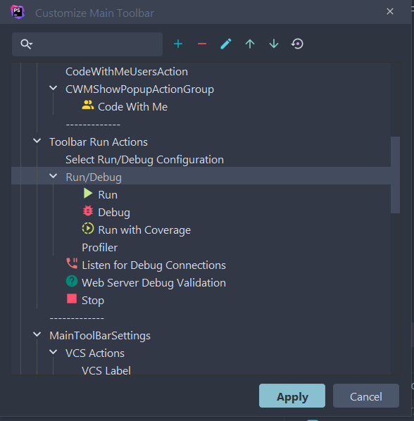
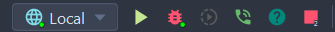
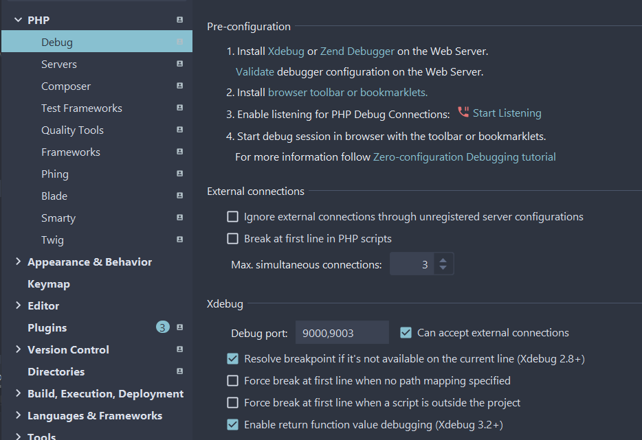
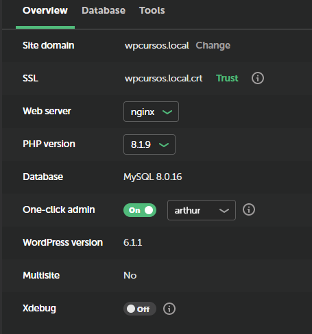
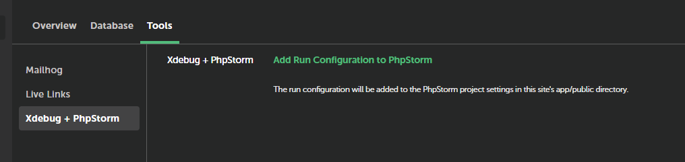
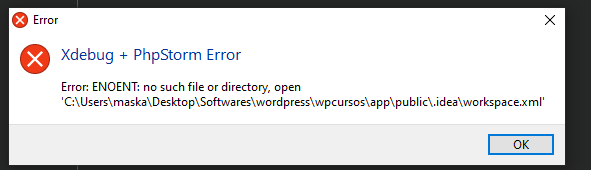
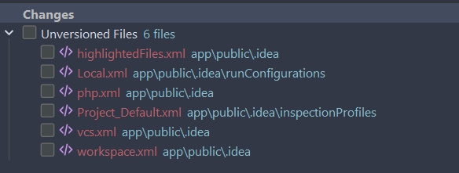
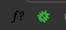
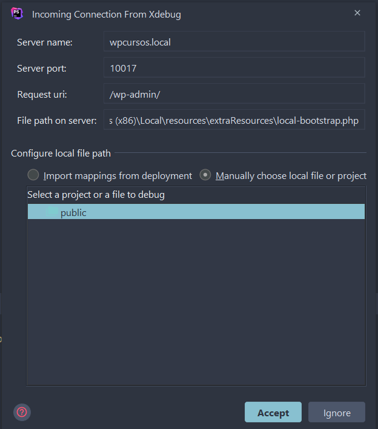

# Configurações iniciais

1. em phpstorm é inprencidivel que vc tenha essa toolbar configurada:

2. em phpstorm desmarque as 2 caixas da ultima sessão:

3. em local by flywheel marque a caixa xdebug 

4. em local by flywheel ative o run clicando em "add run configuration to phpstorm"

> pode ser que de algum erro, só ignore

> mas mesmo com erro, é preciso adicionar esses arquivos em /public:

5. em browser ative a extensão

6. em phpstorm, ative o listening e atualize alguma pagina do browser

É só seguir a documentação padrão, e caso não dê certo, veja esse topico:
https://community.localwp.com/t/local-bootstrap-php-is-triggering-a-breakpoint-when-xdebug-is-enabled/22229/5

